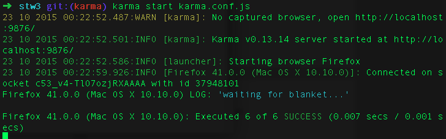

# Práctica 3 de Sistemas y Tecnologías Web

Se ha añadido a la práctica [anterior](https://github.com/giffunis/STW_temp_converter2) el uso de:

* Web Workers
* Karma
* Travis

## Travis

## Karma

## Enlaces

* [Despliegue](http://giffunis.github.io/STW3/)
* [Repositorio en GitHub](https://github.com/giffunis/STW3/tree/travis)
* [blanket](http://giffunis.github.io/STW3/vendor/test.html)
* [Travis](https://travis-ci.org/giffunis/STW3)
* [Mi página web de la asignatura](http://giffunis.github.io/stw.html)
