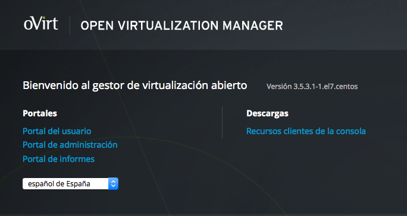
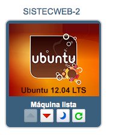
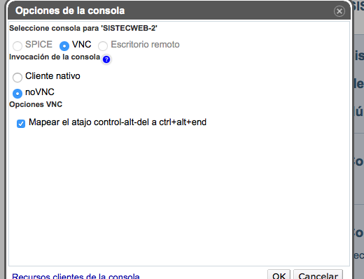
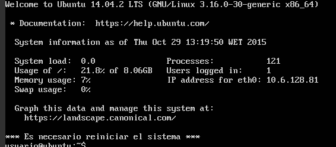
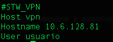

# Sistemas y Tecnologías Web

### Tutorial para Mac OS-X de implantación en iaas.ull.es

* Para ver este tutorial en html, (click aquí)[]

#### 1. Primer acceso a [iaas.ull](http://iaas.ull.es/ovirt-engine/)

Click en "Portal del usuario", introducimos el alu y la contraseña.

Nos aparecerá la máquina creada por el profesor:

Accederemos a "VNC modificar", que se encuentra en el panel derecho y elegiremos "noVNC", tal y como aparece en la imagen: 

Arrancamos nuestra máquina (Nombre de usuario y contraseña: usuario)

#### 2. Configurar el acceso desde ssh

Debemos distinguir que existen dos posibilidades:
* Desde la red de la ULL.
* Desde otro sitio.

Pasos en común:

  * Debemos conocer la ip de nuestro servidor, para ello:

        $ ifconfig
  * Agregaremos nuestra máquina a nuestro fichero `~/.ssh/config`
  

Si nos encontramos en la red de la ULL:
* Debemos autentificarnos en [acceso.ull](http://acceso.ull.es/)
* Ejecutar el comando:

      $ ssh vpn

Si nos encontramos fuera:
* Instalar y configurar [Cliente VPN Global Protect para Mac OSX](https://usuarios.ull.es/vpn/mac.html)
* Ejecutar el comando:

      $ ssh vpn

#### 3. Puesta en marcha de la práctica anterior

3.1. Instalamos nodejs (En mi caso lo venía instalado pero no me funcionó hasta que lo reinstalé):

    $ sudo apt-get install nodejs-legacy

3.2 Instalamos npm

    $ sudo apt-get install npm

3.3 Hacemos un git clone del repo

3.4 Instalamos las dependencias.

    $ npm install

3.5 Arrancamos el servidor

    $ node static-server.js

Fin

### Links de la práctica:
* **Travis:** 
* **[Despliegue](http://10.6.128.81:8080/index.html)**
* **[Blanket](http://10.6.128.81:8080/vendor/test.html)**
* **[Repositorio en GitHub](https://github.com/giffunis/STW4)**
* **Página web de la [asignatura](http://giffunis.github.io/stw)**
